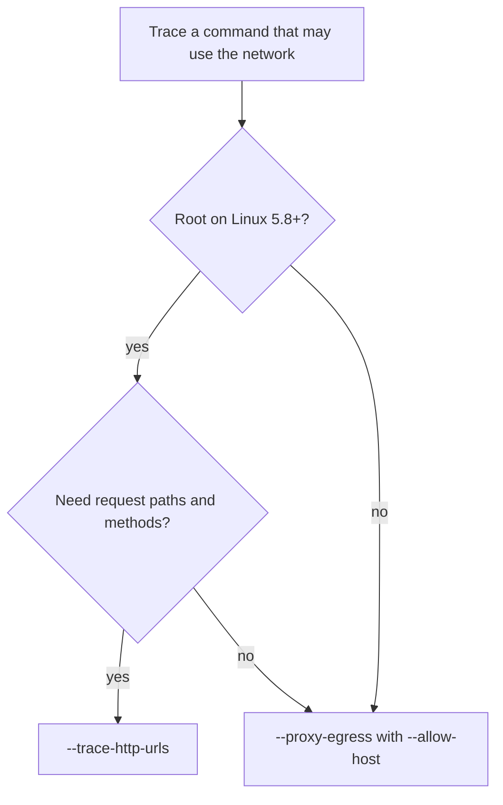

# Lesson 34 - Watching untrusted commands run without letting them touch anything

Lesson 16 introduced `tracebom` as a way to record the shared libraries a
program loads. Since then the sandbox underneath it, `@cdxgen/safer-exec`
1.0, gained an egress proxy, a dry-run mode, and ecosystem policies. Together
they answer a different kind of question. Not only what the process used, but
what it tried to reach and what it tried to change. That is the question you
face when a build step, a postinstall script, or a model downloader comes from
somewhere you do not fully trust, and it is the question this lesson practices.

## Goal

Pre-requisites: Node.js 24 or newer with `@cdxgen/cdxgen` installed globally,
on Linux or macOS. Root is not required except where the lesson says so. Any
small project with a build or install step works as a trace target.

By the end of this lesson you should be able to:

1. Choose between the three network visibility modes of `tracebom` and state
   what each one cannot see.
2. Turn every allowed and denied egress attempt into a CycloneDX service
   carrying a `cdx:dynamic:egressDecision` property.
3. Run a command in sandbox dry-run and read the attempted-operation counts
   from the BOM metadata, including the case where the counts could not be
   captured.
4. Start from a named ecosystem policy and tighten it with additional flags.

## Step 1: Three ways to see the network

By default the tracebom sandbox has no network at all. A program that needs
the network simply fails, which is safe but tells you nothing. Two flags turn
that denial into observation, and they observe different things.

`--trace-http-urls` attaches eBPF probes to the TLS libraries the traced
process uses. It records full request URLs, so the resulting services carry
paths, HTTP methods, and query parameter names. The cost is platform: it needs
Linux kernel 5.8 or newer and CAP_BPF plus CAP_PERFMON, which in practice
means root. It also sees HTTPS only, because the probes sit in the TLS
libraries. A plain HTTP request never passes through them.

`--proxy-egress` takes the opposite approach. It enables the network but
forces every connection through a hostname-pinning proxy, and only hosts
listed in `--allow-host` or `--allow-url` are reachable. It fails closed: with
an empty allowlist every target is denied. It works on every platform the
sandbox works on, including macOS where eBPF is unavailable, and it records
denied attempts as faithfully as allowed ones. The trade-off is resolution:
the proxy sees scheme and host, not the path, so an endpoint like
`https://telemetry.example.com/collect?token=xyz` is recorded as
`https://telemetry.example.com` with the decision `denied`. For an inventory
of who the command talks to, that is exactly the resolution you want.



Try the proxy mode on a harmless command:

```bash
tracebom --cmd "npm view left-pad version" --proxy-egress --allow-host registry.npmjs.org -o bom.json
```

Open `bom.json` and look at `services`. Alongside any URL-traced services you
find one entry per host the proxy saw:

```json
{
  "name": "dynamic-registry.npmjs.org-443",
  "bom-ref": "urn:service:dynamic:dynamic-registry.npmjs.org-443",
  "endpoints": ["https://registry.npmjs.org"],
  "properties": [{ "name": "cdx:dynamic:egressDecision", "value": "allowed" }]
}
```

Now add a package with a chatty postinstall script to a scratch project and
trace its install with only the registry allowed. Every analytics or
telemetry host the script reaches for appears in the same list with
`cdx:dynamic:egressDecision=denied`, which is often the most interesting
reading in the whole BOM. Note that the service endpoint is the scheme and
authority only, and the decision is the only judgment recorded; the proxy
never writes query strings, tokens, or request bodies into the BOM.

Two warnings to read carefully when a trace behaves oddly. If the traced
command exits non-zero, tracebom warns you because the trace may be partial:
a build that dies halfway may never have reached the step that does the
talking. And the notice explaining that URL tracing is unavailable now prints
whatever the exit code was, so an unprivileged run can no longer silently
produce a BOM with no services and no explanation.

## Step 2: The dry run

Sometimes you do not want observation of side effects, you want denial with a
receipt. `--sandbox-dry-run` denies every filesystem write and every network
connection, lets the command run to whatever extent it can under those rules,
and records what it attempted as counts in the BOM metadata.

```bash
tracebom --cmd "node postinstall.js" --sandbox-dry-run -o bom.json
```

The counts land under `metadata.properties`:

```json
"properties": [
  { "name": "cdx:dynamic:dryRun", "value": "true" },
  { "name": "cdx:dynamic:dryRun:captured", "value": "true" },
  { "name": "cdx:dynamic:dryRun:totalEvents", "value": "41" },
  { "name": "cdx:dynamic:dryRun:fileWrites", "value": "12" },
  { "name": "cdx:dynamic:dryRun:networkOutbound", "value": "6" },
  { "name": "cdx:dynamic:dryRun:execAttempts", "value": "2" }
]
```

The full set of metrics is `totalEvents`, `fileReads`, `fileWrites`,
`fileMetadata`, `networkOutbound`, `networkBind`, `execAttempts`, and
`forkAttempts`. Paths and targets are deliberately not recorded, so the
receipt can be shared without leaking your directory layout or the URLs
involved. For where the writes went, combine the dry run with a real run
under `--diff`, which tracks created, modified, and deleted files.

One caveat deserves its own sentence. On Linux the counts need an event
source, which in practice means `strace`. Without it, or with a strict
`ptrace_scope`, every side effect is still denied but nothing can be counted,
and the BOM says so with `cdx:dynamic:dryRun:captured=false`. Absence of
counts is not absence of activity. Check the `captured` property before you
report a quiet run as a clean one.

The flag is named `--sandbox-dry-run` rather than `--dry-run` because
`--dry-run` already means something else across cdxgen: it is the global
mode that reports what a scan would do without writing outputs, and a
sandbox flag sharing its name would have made every dry-run trace unable to
write the BOM you asked for.

## Step 3: Policies and the extra bars

Setting allow-lists by hand grows tedious because ecosystems have known,
stable footprints. `--policy` starts from a named safer-exec policy for a
given ecosystem and applies it before every other option, so the remaining
flags refine the policy instead of fighting it:

```bash
tracebom --cmd "npm ci" --policy npm --deny-persistence-writes -o bom.json
```

The available names include `npm`, `pnpm`, `pypi`, `uv`, `maven`, `cargo`,
`gomod`, and `nuget`. `--policy-file` accepts a safer-exec JSON policy file
instead. An unknown policy name or an unreadable file fails the run with an
error; it does not fall back to an empty sandbox, because a silently ignored
policy would read exactly like a satisfied one in the resulting BOM.

On top of a policy, the hardening flags close specific doors:

| Flag                        | Platform | What it adds                                                                       |
| --------------------------- | -------- | ---------------------------------------------------------------------------------- |
| `--allow-loopback`          | all      | permits connections to loopback addresses                                          |
| `--block-interpreters`      | macOS    | blocks interpreters holding sandbox or task-port exemptions                        |
| `--deny-persistence-writes` | all      | denies writes to LaunchAgents, shell rc files, cron; `--write-paths` stay writable |
| `--private-tmp`             | Linux    | private `/tmp` and `/var/tmp` mounts                                               |
| `--protect-home`            | Linux    | `off`, `read-only`, or `tmpfs` isolation for `$HOME`                               |

## Step 4: Read the run like an analyst

A single trace produces one BOM with three kinds of evidence: components for
the libraries that were loaded, services for the URLs and egress decisions,
and metadata properties for the dry-run counts. Load it in the REPL:

```bash
cdxi bom.json
```

Then `.services` lists every host and endpoint, and `.instrumented` shows the
loaded libraries with their evidence and confidence. A workable review order
is the reverse of what the BOM emphasizes. Start with the denied hosts, since
those are the attempts the sandbox stopped. Continue with the allowed hosts
and ask whether each one belongs to the story you expected. Finish with the
dry-run counts when you have them, looking for writes and exec attempts that
the command's documentation never mentioned. The library list is the ground
you already know from Lesson 16; the network behavior is the new ground.

## Recap

The sandbox stopped being just a cage. Used deliberately, the three network
modes give you a ladder of visibility: none by default, hosts and decisions
everywhere through the proxy, and full URLs where eBPF is available. The dry
run converts a command's intentions into countable facts without granting
any of them, with `captured=false` as the honest marker of a host that could
not count. Policies encode what an ecosystem's build step legitimately
needs, and the hardening flags close the doors even legitimate steps should
not open. The BOM that comes out is not only an inventory. It is a record of
what a command did and, more telling, what it tried to do.
